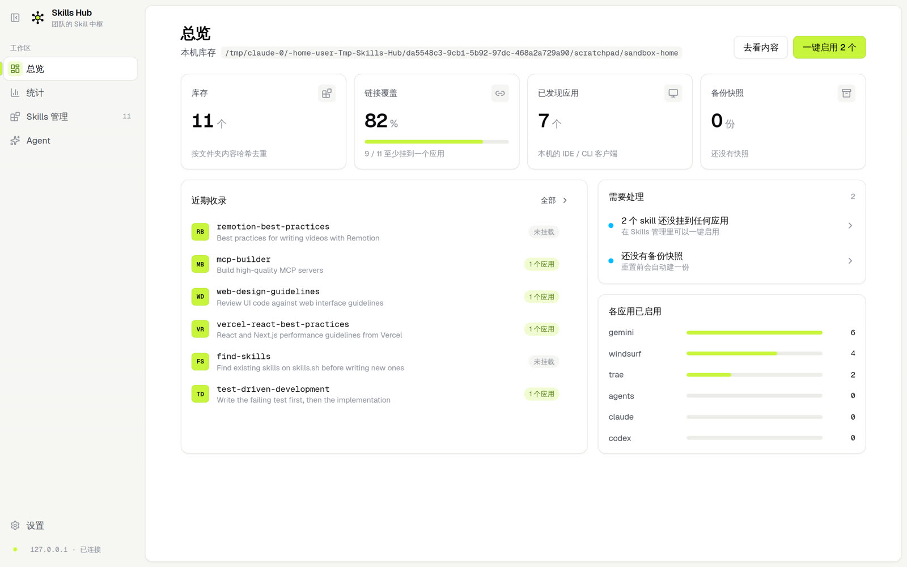
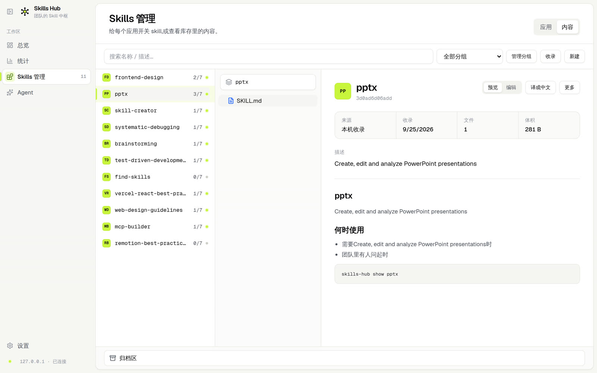
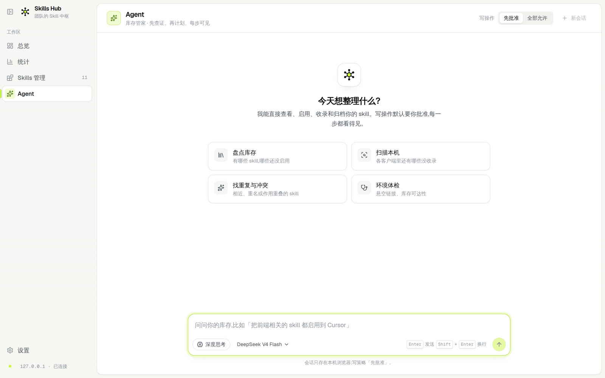
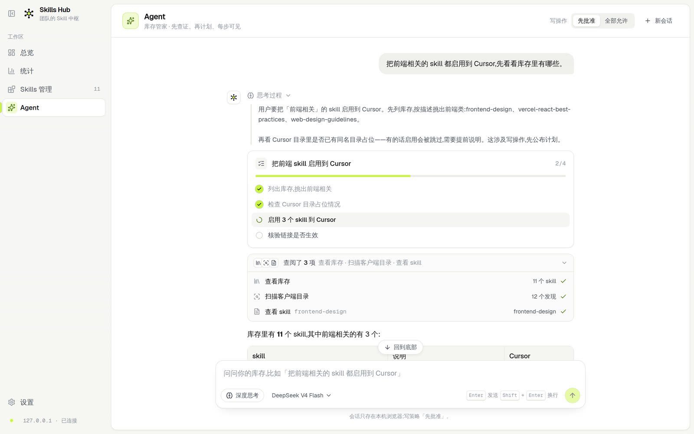
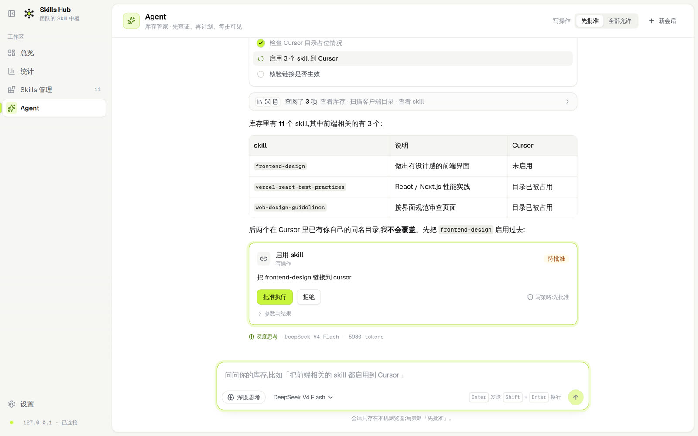

# UI 设计规范 v2:纸白基底 + 唯一信号色 + 统一组件

> 状态:生效 | 适用范围:`apps/web` 全部界面
> 取代 [ui-design-v1.md](./ui-design-v1.md)。v1 的 UX 铁律、组件来源规则、动效类别、Skeleton / Toast / 对话框口径**全部保留**,本文只改视觉语言,并补上 Agent 页的呈现规则。
> 信息架构仍服从 [app-shell-v2.md](../designs/app-shell-v2.md);数据层仍服从 [panel-ia-v1.md](../designs/panel-ia-v1.md);Agent 行为服从 [agent-v0.md](../specs/agent-v0.md)。
>
> **修订理由(2026-09-25)**:v1 的「纯灰阶 + 控件禁止品牌色」在落地后有两个问题:①整页一种白,主区、卡片、底纹之间只剩 1px 边框在分层,「总览 / 需要处理 / 近期收录」读起来是一张表;②主动作、当前板块、已启用开关全是黑色,和正文同色,用户要靠读字判断「这里能点 / 这里是现在」。宣传片(`promo/`)里验证过一套视觉:纸白画布 + 白色主面板分两层,再给「当前 / 主动作 / 已启用」一支唯一的信号色。本次把它收进规范,并同时规定信号色的边界,避免「有了颜色就到处用」。

## 0. 相对 v1 改了什么

| 项 | v1 | v2 |
| --- | --- | --- |
| 基底 | 全白 | 纸白画布 `canvas` 承载侧栏;主区是一块白色主面板(`card`),圆角 + 1px 边框 + 极弱阴影 |
| 品牌色 | 控件 / 导航 / 按钮禁止 | 一支信号色 Volt,分「面」与「线」两种用法,边界见 §2.2 |
| 字体 | 系统栈 | 拉丁与数字用 Geist / Geist Mono(本地打包,不走 CDN);中文仍回落系统字体 |
| 阴影 | 默认无,仅两档极弱 | 卡片允许 `--shadow-card`(近乎不可见);浮层 `--shadow-pop`;仍禁止 `shadow-md` 以上与彩色 glow |
| 按钮 | 主 / 次 / 危险 | 加 `accent`(信号色面),每屏最多一个 |
| Agent 页 | 未规定 | §9:推理、计划、工具活动、审批、输入区的统一呈现 |

不变的:三档文本、4px 间距、`rounded-lg` 控件 / `rounded-xl` 卡片、`motion-*` 类别与分层时长、隐藏滚动条、`prefers-reduced-motion`、控件必须来自 `components/ui/`、不做深色模式(令牌已按双主题命名,见 §2.4)。

## 1. 原则

沿用 v1 的八条。补一条:

9. **信号色只回答三个问题**:我现在在哪(当前板块 / 当前选中)、下一步该点哪(每屏唯一主动作)、它是不是已经生效(已启用 / 已链接 / 计划已完成)。答不出这三个问题的地方,不用信号色。

## 2. 颜色

### 2.1 令牌(`apps/web/src/index.css` 的 `@theme`)

| 令牌 | 值 | 用途 |
| --- | --- | --- |
| `canvas` | `#f6f6f3` | 应用画布、侧栏 |
| `card` / `background` | `#ffffff` | 主面板、卡片、浮层 |
| `surface` | `#f5f5f2` | hover 底纹、表头、代码块、内嵌区 |
| `surface-strong` | `#ecece7` | 选中行、分段控件槽、进度条轨道 |
| `ink-strong` | `#0b0c0e` | 标题、正文首选 |
| `ink-mid` | `#4a505a` | 描述、元信息 |
| `ink-faint` | `#8b919b` | 占位、时间戳(白底 3.2:1,只放非关键信息) |
| `line` | `#e7e7e1` | 卡片、输入框、分隔 |
| `line-strong` | `#cfcfc7` | hover 边框、焦点前态 |
| `volt` | `#4d7c0f` | 信号色**线 / 字**:浅底上 4.6:1 以上 |
| `volt-fill` | `#c8f53c` | 信号色**面**:主动作、开关、进度、Logo 核心;面上的字一律 `volt-ink` |
| `volt-ink` | `#0b0e02` | 信号色面上的文字(15:1) |
| `volt-soft` | `#f1fbd2` | 信号色浅底:选中导航的图标底、计划完成项、成功提示 |
| `volt-line` | `#b6de45` | 信号色面 / 浅底的描边 |

状态色沿用 v1(浅底深字):成功 `emerald`、警告 `amber`、错误 `red`,只表达状态。

### 2.2 信号色边界

| 允许 | 形态 |
| --- | --- |
| 当前板块(侧栏) | 左侧 2px `volt-fill` 指示条 + 图标 `volt-soft` 底 |
| 每屏唯一主动作 | `Button variant="accent"`(面 + 细描边) |
| 开关打开、复选框选中 | `volt-fill` 面 + `volt-line` 描边,滑块位置同时表达状态(面对白底只有 1.27:1,不能只靠颜色) |
| 进度 / 覆盖率 / 计划完成度 | `volt-fill` 条 |
| 已链接 / 已完成 小圆点与 ✓ | `volt`(线 / 字) |
| 焦点环 | `ring-2 ring-volt-fill/60` |
| 统计图「启用」系列 | 见 §2.3 |

禁止:整块信号色背景的卡片或横幅、信号色正文段落、信号色图标装饰、一屏两个 `accent` 按钮、渐变、glow 光晕、毛玻璃。

### 2.3 图表与来源

统计图系列色固定:启用 `#9ccc2a`、查看 `#38bdf8`、来源琥珀 `#d98a06`、来源紫 `#7c6cf0`。轴、网格、标签仍用 ink / line。柱上必须有数字标签,不靠色差读数。

来源标记(skill 行首的两字母方块)按 `origins[0].kind` 取色:`local-scan` 本机收录 `volt-fill`、`github` `#e0845e`、`skills-sh` `#a293ff`、`authored` 自建 `#ffb547`、`archive-restore` 与未标记 `surface-strong`;方块内文字一律 `ink-strong`。只出现在行首方块里。

### 2.4 双主题命名

令牌名不带「light」,值集中在 `@theme`。本轮不提供深色模式(v1 规定不变);将来要做时只换一组值,不改业务类名。宣传片的深色版令牌见 `promo/src/styles/tokens.css`。

## 3. 字体与字号

- 界面:`Geist Variable` → `"PingFang SC", "Hiragino Sans GB", "Microsoft YaHei", "Noto Sans SC", system-ui`;代码 / 路径 / 哈希 / 数字:`Geist Mono Variable` → `ui-monospace`
- 通过 `@fontsource-variable/geist` 与 `@fontsource-variable/geist-mono` 本地打包(面板离线可用);**不打包中文字体**(体积)
- 字号档位沿用 v1;新增 `KPI 数字`:`text-3xl font-semibold tracking-tight tabular-nums`
- 标题不超过 semibold;数字一律 `tabular-nums`

## 4. 间距与布局

- 4px 网格沿用 v1
- 壳:`canvas` 画布上左侧栏 + 右侧白色主面板,主面板与画布外沿留 8px(`m-2`),圆角 `rounded-xl`
- 页面内边距 `px-8 py-7`;页头(标题 + 描述 + 右侧动作)与内容之间 `mb-6`
- 内容最大宽度:总览 / 统计 `max-w-6xl`,Agent 对话列 `max-w-3xl` 居中

## 5. 圆角、边框、高度

| 元素 | 规则 |
| --- | --- |
| 卡片 | `rounded-xl border border-line bg-card shadow-card` |
| 可点卡片 | hover:`border-line-strong` + `shadow-lift`,按下 `motion-press` |
| 控件 / 对话框 | `rounded-lg`;对话框面板 `rounded-xl shadow-pop` |
| 标签 / 计数 | `rounded-full` 胶囊;按钮不用胶囊 |
| 浮层(菜单、提示) | `rounded-lg border border-line bg-card shadow-pop` |
| 遮罩 | `bg-ink-strong/30`,无 blur |

阴影令牌:`--shadow-card`(0 1px 2px / 4%)、`--shadow-lift`(hover)、`--shadow-pop`(浮层)、`--shadow-thumb`(分段选中块)。其余禁止。

## 6. 按钮

| variant | 形态 | 用途 |
| --- | --- | --- |
| `default` | `ink-strong` 面白字 | 常规主动作(对话框确认) |
| `accent` | `volt-fill` 面 + `volt-line` 描边 + `volt-ink` 字 | 每屏唯一最重要动作(去收录、发送、批准) |
| `outline` | 白底描边 | 次动作 |
| `ghost` | 无底,hover `surface` | 工具栏、行内动作 |
| `destructive` | 白底红字红描边 | 危险动作 |
| `link` | 下划线文字 | 行内跳转 |

## 7. 动效

沿用 v1 §6 的 token 与 `motion-*` 类别,不新增时长。新增两个仅限 Agent 页的状态动画(都受 `prefers-reduced-motion` 约束):

- `animate-shimmer`:「正在思考 / 正在执行」文字的明暗扫光,1.8s 循环
- `animate-caret`:流式输出末尾的光标,1s 闪烁

## 8. 组件清单

仍然只有 `components/ui/` 一套:Button、Card(`Card` / `CardTitle` / `CardValue`)、Badge、Input / NativeSelect、Textarea、Switch、Checkbox、SegmentedTabs、Dialog、DropdownMenu、Tooltip、Table、Skeleton、Collapsible、ScrollArea、Separator、Chart、Toaster。v2 新增:

- `Logo`:Hub 标志(墨色轮辐 + 信号色核心),侧栏与空状态用
- `SourceGlyph`:行首两字母来源方块(§2.3)
- `Kbd`:键位提示(Agent 输入区)

## 9. Agent 页呈现规则

Agent 的推理链是**给人看的工作记录**,不是调试日志。一条助手消息自上而下只会出现以下几种块,顺序即模型产出顺序:

| 块 | 来源 | 呈现 |
| --- | --- | --- |
| 思考 | `reasoning` part(开启「深度思考」时) | 折叠块,标题「思考中…」(扫光)/「已思考」;展开是 `ink-mid` 小字,左侧 2px `line` 竖线;流式时默认展开,结束后自动收起 |
| 计划 | `update_plan` 工具(见 agent-v0.md §8) | 计划卡:标题 + 进度条(`volt-fill`)+ 步骤清单(待办 ○ / 进行中 旋转 / 完成 ✓ `volt`);同一消息内只显示**最新一版**,旧版本不重复渲染 |
| 工具活动 | 连续的只读工具调用 | 合并成一行「查阅了 N 项」可展开的活动组;每项是 图标 + 中文动作名 + 参数摘要 + 结果摘要 + 状态 |
| 写操作 | 写工具 | 独立卡片,不并入活动组;`ask` 下待批准时是审批卡:说明将要改什么、参数、`批准`(accent)/ `拒绝` |
| 正文 | `text` part | Markdown;流式末尾 `animate-caret` 光标 |
| 元信息 | message metadata | 消息底部一行 `ink-faint` 小字:模型 · 深度思考 · token 用量;附复制按钮 |

输入区:圆角卡片内的自适应文本框(1–8 行)+ 底部工具条(深度思考开关、写策略、模型、发送 / 停止)。空状态:Logo + 一句问候 + 四张能力卡片(点击直接发送)。滚动:贴底跟随,用户上滑后停止跟随并出现「回到底部」。

## 10. 禁止清单

v1 §10 全部保留;另外禁止:信号色大面积铺底、一屏多个 `accent`、为 Agent 自造第二套消息气泡组件、在正文里重复渲染工具参数 JSON。

## 11. 落地示意

沙箱数据下的实际渲染(2026-09-25,1440×900):

| 总览 | Skills 内容 |
| --- | --- |
|  |  |

| Agent 空状态 | Agent 推理链(思考 / 计划 / 活动组) | Agent 审批卡与元信息 |
| --- | --- | --- |
|  |  |  |
